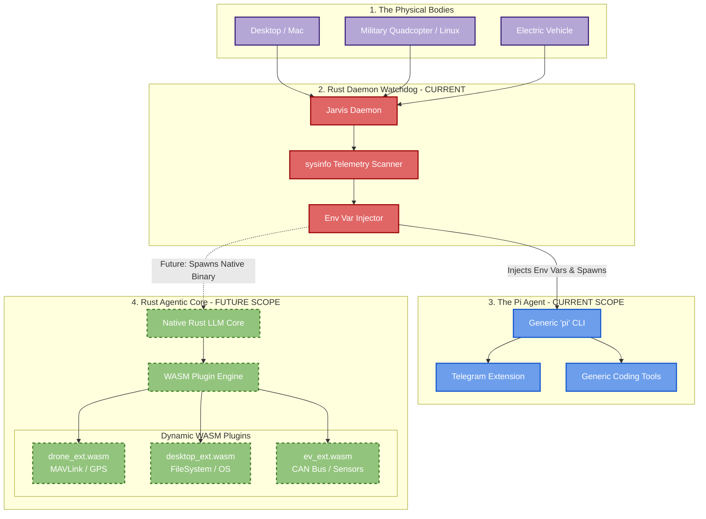

# Jarvis Ecosystem Master Architecture

This document maps out the current functional architecture as well as the future roadmap for the polymorphic Jarvis ecosystem. It illustrates how the "Nervous System" (Daemon) couples with either the current `pi` agent or the future Rust-native Agentic Core.

## 1. Ecosystem Overview

## 2. Current Scope (What is working today)

The system currently operates flawlessly as a decoupling of **Hardware Management** and **Agentic Logic**.

1. **The Daemon (Rust):** Starts on system boot via macOS `launchd` or Linux `systemd`. It scans the system using `sysinfo`, determines CPU/RAM, and injects `JARVIS_DEVICE_TYPE`.
2. **The Brain (Node/Pi):** The Daemon spawns the generic `pi` CLI. 
   - On Mac, it visually pops open `Terminal.app` to provide an interactive developer experience.
   - On Linux (Drone), it runs entirely headlessly in the background.
3. **The Limitation:** The `pi` tool is primarily designed for desktop coding assistance. It is single-threaded (Node.js) and somewhat heavy for an embedded military drone.

## 3. Future Scope (The Native Evolution)

To achieve microsecond latency, absolute memory safety, and 100% offline edge-computing capability, the "Brain" will be completely rewritten in Rust.

1. **Rust Agentic Core:** A custom binary that replaces the `pi` tool. It natively queries local models (e.g., Llama.cpp) and maintains conversation memory.
2. **WASM Polymorphism:** Instead of bloated Python or Node extensions, capabilities are distributed as highly compressed WebAssembly (`.wasm`) plugins.
   - When the Daemon injects `JARVIS_DEVICE_TYPE=Military_Quadcopter`, the Rust Core instantly loads `drone_ext.wasm` into a secure sandbox, gaining the ability to fly.
3. **Encrypted Mesh Radio:** Moving away from standard internet APIs (like Telegram), the Rust Core will use Silvus or TrellisWare mesh radios to communicate directly with Tony's device, ensuring operation in denied environments.
