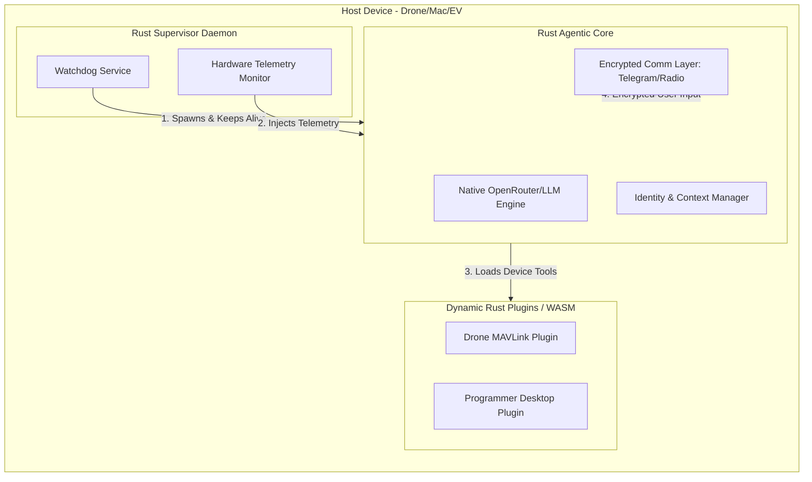

# Jarvis Universal System Architecture v2.0

This document outlines the architecture for the "All-Rust" highly performant Jarvis ecosystem. We have moved away from Python-based agent cores to achieve maximum security, memory safety, and native system integration.

## System Flow

## 1. The Nervous System (Rust Daemon)
- **Role:** Pure Watchdog. 
- **Action:** Starts automatically on system boot (via systemd/launchd).
- **Responsibility:** Injects hardware context (RAM, CPU, Device Type) into environment variables and keeps the Agentic Core running. It handles zero LLM logic.

## 2. The Brain (Rust Agentic Core)
- **Role:** The execution pipeline.
- **Why Rust instead of Python?** Maximum performance, memory safety (crucial for drones), concurrent tool execution, and zero-dependency deployments (no pip installs needed on a military drone).
- **Responsibility:**
  1. Opens connection to User (Telegram for Desktop, Encrypted Mesh Radio for Defense).
  2. Parses user intent using OpenRouter/Local LLaMA APIs.
  3. Executes system tasks directly natively.

## 3. The Polymorphic Extensions (Modular Tooling)
The Agentic Core is universal. It doesn't know what it is until it loads its extensions.
We use a high-performance plugin architecture (e.g., WebAssembly (WASM) or dynamic Rust libraries).
- **Drone Extension:** Provides `takeoff()`, `read_gps()`.
- **Programmer Extension:** Provides `git_commit()`, `read_file()`.
- **EV Extension:** Provides `read_can_bus()`, `set_climate()`.
